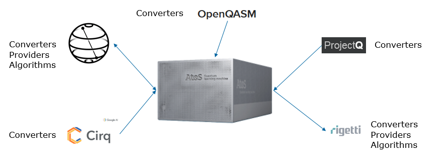

.. MyQLM interoperations documentation master file, created by
   sphinx-quickstart on Fri Jun  7 15:50:49 2019.
   You can adapt this file completely to your liking, but it should at least
   contain the root `toctree` directive.

Welcome to MyQLM interoperations's documentation!
=================================================

.. toctree::
   :maxdepth: 2
   :hidden:

   qiskit
   pyquil
   cirq
   projectq
   openqasm
   MyQLM interoperations
   Tutorials/Qiskit
   Tutorials/Pyquil
   Tutorials/Cirq
   Tutorials/Projectq
   Tutorials/Openqasm
        

.. contents:: Table of Contents

We have managed to establish binders between multiple languages :

Refer to :doc:`MyQLM interoperations` document to figure out how we can use these binders through examples and 
explanations, for further information about usage, refer to the linked tutorials on the left.

.. Indices and tables
    ==================

    * :ref:`genindex`
    * :ref:`modindex`
    * :ref:`search`
